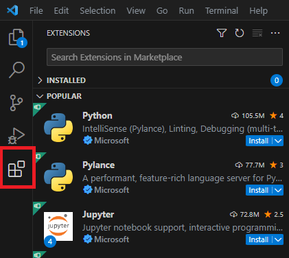
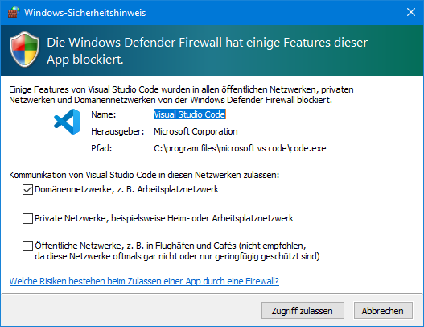

# IDE

After the successful installation of Python, we use an IDE
(=Integrated Development Environment) which is simply put, a place to write and 
execute `Python` code. There are many IDEs available, but we recommend using 
[Visual Studio Code (VS Code/VSC)](https://code.visualstudio.com/).

## Visual Studio Code

### General Information

<!-- Following sections were copied from Manuels PyGuide -->

VSCode is a *free, open-source* code editor developed by Microsoft :fontawesome-brands-windows:.
It has gained immense popularity among developers for its versatility and
extensive extension ecosystem, making it a powerful tool for various 
programming tasks, including Python and Jupyter Notebook programming. 
Some key features of VSCode include:

- Cross-Platform: VSCode is available for Windows :fontawesome-brands-windows:,
macOS :fontawesome-brands-apple:, and Linux :fontawesome-brands-linux:, 
making it accessible to developers on different operating systems.
- Lightweight: It’s known for its speed and efficiency. VSCode launches quickly
and consumes minimal system resources.
- Extensible: VSCode supports a wide range of programming languages and 
technologies through extensions. You can customize the editor with extensions 
to add new features, integrations, and tools. VSCode offers intelligent code 
completion and suggestions, which can significantly boost your productivity 
while writing code. Additionally, there is an extension for GitHub
Copilot which gives you real-time AI-based suggestions (free for students;
sign-up [here](https://github.com/education/students))
- Version Control: It has built-in `Git` support, making it easy to manage 
version control and collaborate with others using Git repositories.
- Large Community: VSCode has a large and active community, which means you can
find plenty of resources, extensions, and tutorials to enhance your coding
experience.

### Setup

Download the installer from the [official website](https://code.visualstudio.com/Download).
The installation is straightforward, so we won't cover it in detail. 

#### Extensions

As already mentioned, VSCode can be used for a wide range of programming
languages. To do this, we need to install the corresponding extensions. 
Therefore, start VSCode and click on the sidebar on `Extensions`. Then search 
and install `Jupyter` and `Python` (both from Microsoft). 

<figure markdown="span">
  { width="400" }
  <figcaption>Install the Python and Jupyter extension</figcaption>
</figure>

Now, restart VSCode.

#### Jupyter notebook

Next, we create a new file to execute our first Python code. 
To do so, we use [Jupyter notebooks](https://jupyter.org/).
Jupyter notebooks are basically composed of cells. A cell can either contain 
code or text. However, first, we have to set up our first notebook. We will cover
the notebooks in the next [section](#more-on-jupyter-notebooks) in more detail.

Hence, we first select a folder in which we want to save our work. We go to 
*`File`* :fontawesome-solid-arrow-right: *`Open Folder`* and choose a folder.
Then click on explorer in the sidebar where your folder should be opened. Right 
click somewhere in the explorer and select *`New File`*. Type a name for 
your file with the extension `*.ipynb`.
If not automatically, open the new file. Click on *`Select Kernel`* in the 
upper right corner of VSCode and select *`Python Environment`*
:fontawesome-solid-arrow-right: your `Python` installation.

<figure markdown="span">
  { height="400" }
  <figcaption>Select your Python kernel.</figcaption>
</figure>

If your firewall asks, allow access.

<figure markdown="span">
  { width="400" }
  <figcaption>Allow access.</figcaption>
</figure>

Now, add your first code cell with the *`+ Code`* button in the upper left 
corner. Add following line.

```py
print("Hello World!")
```

<figure markdown="span">
  { width="680" }
  <figcaption>Run your first code snippet.</figcaption>
</figure>

After clicking on *`Run All`*, a popup will appear to install the `ipykernel`.
Click on *`Install`*. 

<figure markdown="span">
  { width="450" }
  <figcaption>Last missing piece - the ipykernel.</figcaption>
</figure>

After the installation, you should be greeted with following output

```title=">>> Output"
Hello World!
```

Congratulations 🎉, you've successfully executed your first `Python` 
:fontawesome-brands-python: code!

## ... more on Jupyter notebooks

### Why?

One of the key features of Jupyter Notebook is the combination of code cells 
with rich text elements, allowing you to create comprehensive documents that 
blend code, visualizations, and explanatory text. This makes it a powerful tool
for creating data analysis reports, sharing research findings, or documenting 
code workflows.

In addition to code execution and documentation capabilities, Jupyter Notebook 
offers a wide range of extensions and integrations with popular data science 
libraries, plotting libraries, and other tools. It provides a flexible and 
interactive environment for data manipulation, visualization, and analysis.

### Cells

As previously discussed, Jupyter notebooks are composed of cells. A cell can 
contain Python code or text. To add a text cell, click on *`+ Markdown`*. 
Markdown :fontawesome-brands-markdown: is a lightweight markup language with 
plain text formatting syntax. You can simply write text, add images and links
within a markdown cell. [This guide](https://www.markdownguide.org/basic-syntax/)
offers a nice comprehensive overview of Markdown.

???+ info

    Don't worry about Markdown too much, it is simple to use and 'supports' 
    plain text. So just start writing.

#### Execution

You can execute cells one by one. Either by clicking on the *`Exceute Cell`* 
button on the left side of your current cell. Or by using the shortcut 
++ctrl+enter++.

Run all cells with the corresponding *`Run All`* button on top.

## Coming up ...

Next, we will cover some basic Python concepts, and you will get more familiar 
with code cells.